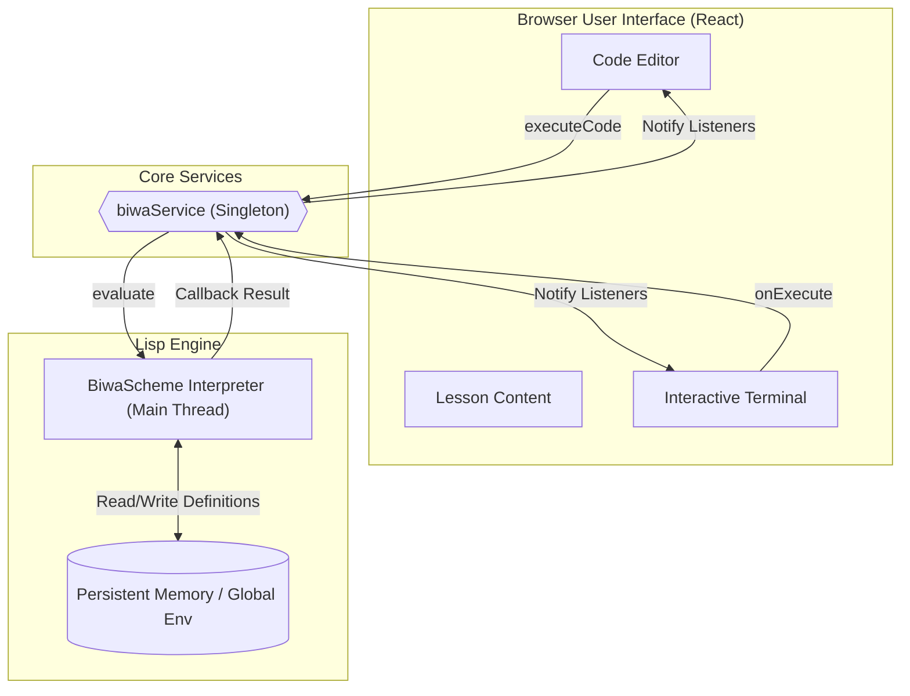
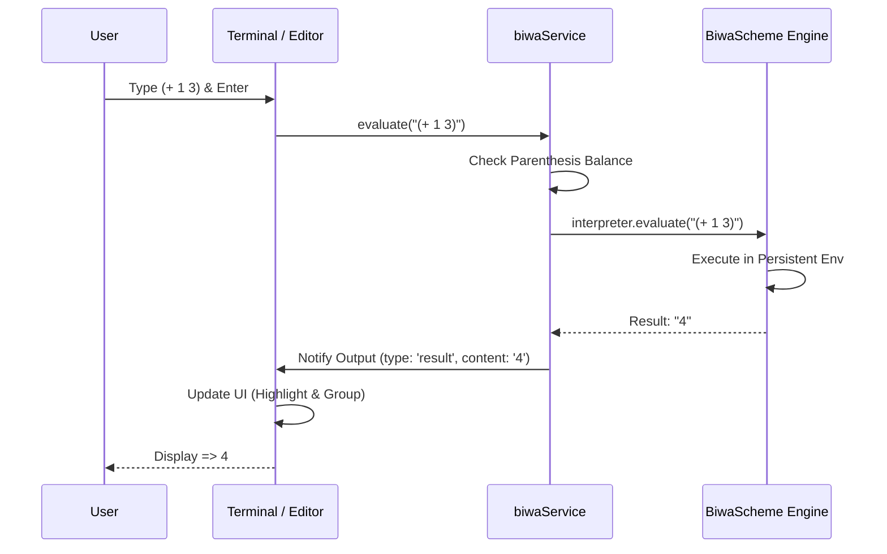

# Parens & Power (P&P): The Lisp Way

**P&Pr** is an interactive very simple scketch of aeducational app designed to geing start with the fundamentals of Scheme/Lisp. Inspired by the legendary **SICP** (*Structure and Interpretation of Computer Programs*), it provides a seamless, zero-latency environment to explore functional programming, homoiconicity, and metaprogramming.

## System Architecture

The application is built with a focus on **persistence** and **instantaneous feedback**. Unlike traditional web-based interpreters that use high-overhead Web Workers, we leverage a main-thread singleton architecture to ensure that your definitions (functions and macros) persist throughout your entire learning session.

### System Topology



### Execution Sequence



## 🌟 Key Features

### 1. Instant Persistent REPL
*   **Zero Latency**: By running the interpreter on the main thread, we eliminate the "cold start" and serialization overhead of Web Workers.
*   **State Persistence**: Definitions in one lesson are available in the next. Define an `infix` macro once, use it everywhere.
*   **Interactive Design**: A fixed top-prompt REPL inspired by the official BiwaScheme.org environment.

### 2. Advanced UX & Highlighting
*   **Real-time Syntax Highlighting**: Powered by **Prism.js**, providing immediate visual feedback for Lisp/Scheme syntax.
*   **Smart Multi-line Input**: 
    *   `Enter`: Intelligently chooses between *execution* (if parentheses are balanced) or *auto-newline* (if code is incomplete).
    *   `Shift + Enter`: Manual newline for block formatting.
    *   `Auto-expanding Input`: The prompt area grows naturally as you paste or type large blocks of code.

### 3. Pedagogical History
*   **Interaction Grouping**: Every execution is grouped as a single block (Command → Output), reversed globally so the latest result is always visible at the top, but the internal sequence remains logical.

## 🛠 Technical Stack

| Component | Technology |
| :--- | :--- |
| **Framework** | React 19 (Main Thread Control) |
| **Interpreter** | [BiwaScheme](https://www.biwascheme.org/) (R6RS/R7RS hybrid) |
| **Styles** | Vanilla CSS + Tailwind (Rich Dark Theme) |
| **Highlighting** | PrismJS (Lisp Grammar) |
| **Icons** | Lucide React |

## 🚀 Getting Started

1.  **Clone & Install**:
    ```bash
    git clone ...
    pnpm install
    ```

2.  **Run Development**:
    ```bash
    pnpm dev
    ```

3.  **Explore**:
    Navigate through lessons, edit code in the center panel, or experiment directly in the right-hand **Persistent REPL**.

## 📖 Pedagogical Example: Macros

One of the project's highlights is showing how Lisp can *change its own syntax*. Try this in the REPL:

```scheme
;; Define a syntax transformer
(define-macro (infix a op b)
  (list op a b))

;; Use it instantly
(infix 10 + 20)
;; => 30
```

---
*Created for hackers, thinkers, and anyone who believes that Lisp is almost all they need.*